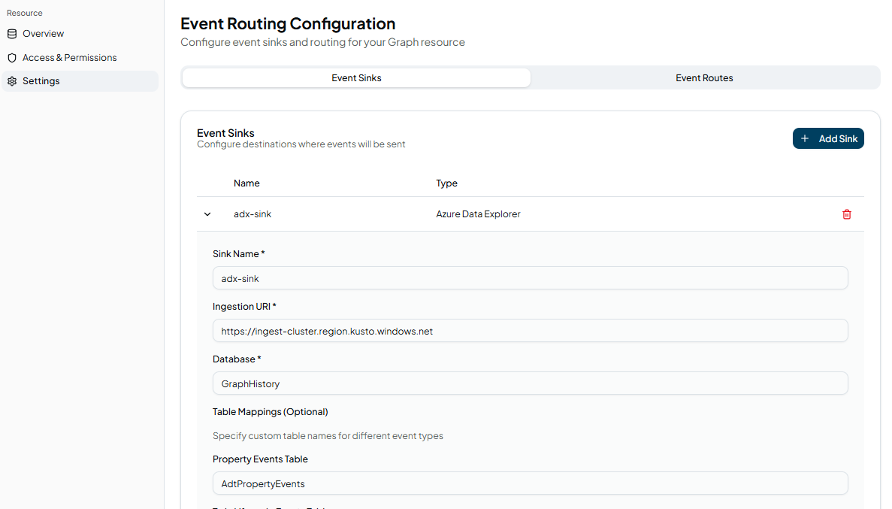

Stream digital twin changes to external systems in real-time and archive complete history for temporal analysis.

## Overview

Event Routing in Konnektr Graph captures every change to your digital twin graph and routes those changes to external systems. This enables you to build:

- **Reactive automation** - Trigger workflows when specific conditions occur
- **Real-time monitoring** - Stream changes to dashboards and alerting systems
- **Data pipelines** - Feed graph mutations to analytics platforms
- **Historical analysis** - Archive complete timeline for temporal queries
- **Audit logging** - Maintain compliance with perfect record-keeping
- **AI agent triggers** - Notify agents when relevant state changes occur

### Key Concepts

**Event Sinks** define *where* events should be sent (Kafka broker, MQTT broker, webhook endpoint, Azure Data Explorer cluster, etc.). You configure connection details and authentication for each sink.

**Event Routes** define *which events* flow to *which sinks*. You can have multiple routes pointing to the same sink, allowing you to route different event types or formats to the same destination.

**Event Formats** determine the structure of emitted events:
- `EventNotification` - Full CloudEvents format with complete details (real-time monitoring, automation)
- `DataHistory` - Optimized format for time-series storage (historical analysis, compliance)

## Event Types

Konnektr Graph emits events for all graph mutations:

| Event Type | Description | Example Use Case |
|------------|-------------|------------------|
| `Twin.Create` | Digital twin created | Log new asset registration |
| `Twin.Update` | Twin property changed | Trigger alert if temperature exceeds threshold |
| `Twin.Delete` | Digital twin deleted | Archive final state before removal |
| `Relationship.Create` | Relationship established | Update dependency graph in external system |
| `Relationship.Update` | Relationship property changed | Recalculate network topology |
| `Relationship.Delete` | Relationship removed | Trigger impact analysis |
| `Telemetry` | Custom telemetry message | Stream sensor readings to time-series DB |

## Supported Destinations

### Kafka / Azure Event Hubs / Fabric Event Streams

Stream events to any Kafka-compatible endpoint including Apache Kafka, Azure Event Hubs, or Microsoft Fabric Event Streams.

**Common use cases:**
- Stream to data lakes (Databricks, Snowflake)
- Feed real-time analytics (Flink, Spark Streaming)
- Integrate with microservices architecture
- Custom storage and processing pipelines

### Azure Data Explorer (Kusto) / Fabric Real-Time Intelligence

Archive events to Azure Data Explorer or Microsoft Fabric Real-Time Intelligence for time-series analytics, historical queries, and compliance.

**Common use cases:**
- Complete data history with temporal queries
- Reconstruct graph state at any point in time
- Compliance and audit logging
- Trend analysis and pattern detection

See [Data History with Azure Data Explorer](/docs/graph/guides/data-history-kusto) for detailed guide.

### MQTT

Publish events to MQTT brokers for IoT platform integration and edge systems.

**Common use cases:**
- Edge device synchronization
- IoT platform integration (AWS IoT Core, Azure IoT Hub)
- Pub/sub messaging for distributed systems

### Webhooks

Send HTTP POST requests to any endpoint for flexible integration.

**Common use cases:**
- Trigger serverless functions (Azure Functions, AWS Lambda)
- Send notifications (Slack, Teams, PagerDuty)
- Custom business logic and automation
- CI/CD pipeline triggers

## Configuration

### Managed (Konnektr Cloud)

Configure event routing through the Konnektr platform web interface.

#### Step 1: Define Event Sinks

1. Navigate to your Graph instance in ktrlplane
2. Go to **Settings** > **Event Sinks**
3. Click **Add Sink** and choose destination type
4. Fill in connection details:
   - **Kafka**: Broker list, topic, SASL credentials (username/password or OAuth)
   - **Azure Data Explorer**: Ingestion URI, database name, service principal credentials
   - **MQTT**: Broker address, port, credentials
   - **Webhook**: Endpoint URL, authentication (Basic, Bearer, API Key, OAuth)
5. Save the configuration

Credentials are stored securely and never exposed in logs or UI.



#### Step 2: Configure Event Routes

1. Go to **Settings** > **Event Routes**
2. Click **Add Route**
3. Configure the route:
   - **Event Format**: Choose `EventNotification` (real-time) or `DataHistory` (historical)
   - **Destination Sink**: Select a configured sink
   - Optionally add filters (coming soon)
4. Save and activate

You can create multiple routes to the same sink with different formats. For example:
- Route 1: `EventNotification` format → KafkaSink (for real-time monitoring)
- Route 2: `DataHistory` format → KafkaSink (for archival processing)

Events matching your routes will immediately start flowing to configured destinations.


### Self-Hosted (Kubernetes / Helm)

For self-hosted deployments, configure event routing in your Helm chart `values.yaml`:

```yaml
config:
  # Define event sinks
  eventSinks:
    kafka:
      - name: KafkaSink1
        brokerList: "kafka.example.com:9092"
        topic: "graph-events"
        saslMechanism: "PLAIN"  # or OAUTHBEARER
        saslPassword:
          valueFrom:
            secretKeyRef:
              name: kafka-credentials
              key: password
    
    kusto:
      - name: AdxSink1
        ingestionUri: "https://ingest-cluster.region.kusto.windows.net"
        database: "GraphHistory"
        clientId:
          valueFrom:
            secretKeyRef:
              name: azure-sp-credentials
              key: clientId
        clientSecret:
          valueFrom:
            secretKeyRef:
              name: azure-sp-credentials
              key: clientSecret
        tenantId:
          valueFrom:
            secretKeyRef:
              name: azure-sp-credentials
              key: tenantId
    
    mqtt:
      - name: MqttBroker1
        broker: "mqtt.example.com"
        port: 8883
        topic: "graph/events"
        username:
          valueFrom:
            secretKeyRef:
              name: mqtt-credentials
              key: username
        password:
          valueFrom:
            secretKeyRef:
              name: mqtt-credentials
              key: password
    
    webhook:
      - name: WebhookEndpoint1
        url: "https://api.example.com/events"
        authenticationType: "Bearer"
        bearerToken:
          valueFrom:
            secretKeyRef:
              name: webhook-credentials
              key: token

  # Define event routes
  eventRoutes:
    - sinkName: KafkaSink1
      eventFormat: EventNotification  # Real-time events
    - sinkName: AdxSink1
      eventFormat: DataHistory        # Historical archive
    - sinkName: MqttBroker1
      eventFormat: EventNotification
    - sinkName: WebhookEndpoint1
      eventFormat: EventNotification

Apply configuration:
```bash
helm upgrade my-graph konnektr/graph -f values.yaml
```

## Event Formats

### EventNotification Format

Full CloudEvents 1.0 format with complete event details. Use for real-time monitoring, automation, and general-purpose event streaming.

**Example Twin.Update event:**
```json
{
  "specversion": "1.0",
  "type": "Konnektr.DigitalTwins.Twin.Update",
  "source": "https://my-instance.api.graph.konnektr.io",
  "id": "550e8400-e29b-41d4-a716-446655440000",
  "time": "2025-01-20T10:30:00Z",
  "subject": "sensor-temp-01",
  "datacontenttype": "application/json",
  "data": {
    "modelId": "dtmi:com:example:Sensor;1",
    "patch": [
      {"op": "replace", "path": "/temperature", "value": 72.5}
    ]
  }
}
```

**CloudEvents Attributes:**

| Attribute | Description |
|-----------|-------------|
| `specversion` | CloudEvents version (always "1.0") |
| `type` | Event type (e.g., `Konnektr.DigitalTwins.Twin.Update`) |
| `source` | URI of the Konnektr Graph instance |
| `id` | Unique event identifier (UUID) |
| `time` | ISO 8601 timestamp when event occurred |
| `subject` | Twin ID or relationship ID affected |
| `datacontenttype` | Content type of data (application/json) |
| `data` | Event payload (format varies by event type) |

### DataHistory Format

Optimized flat format for time-series storage and historical analysis. Designed for efficient querying in analytics databases.

**Example property update record:**
```json
{
  "TimeStamp": "2025-01-20T10:30:00Z",
  "ServiceId": "my-instance.api.graph.konnektr.io",
  "Id": "sensor-temp-01",
  "ModelId": "dtmi:com:example:Sensor;1",
  "Key": "temperature",
  "Value": 72.5,
  "RelationshipId": "",
  "RelationshipTarget": ""
}
```

This format is optimized for:
- Time-series databases (InfluxDB, TimescaleDB)
- Analytics platforms (Azure Data Explorer, ClickHouse)
- Columnar storage (Parquet files, data lakes)

## Security & Authentication

### Kafka Authentication

**SASL/PLAIN:**
```yaml
eventSinks:
  kafka:
    - name: SecureKafka
      brokerList: "kafka.example.com:9092"
      topic: "events"
      saslMechanism: "PLAIN"
      # saslUsername and saslPassword via secrets
```

**SASL/OAUTHBEARER (Generic OAuth 2.0):**
```yaml
eventSinks:
  kafka:
    - name: OAuthKafka
      brokerList: "kafka.example.com:9092"
      topic: "events"
      saslMechanism: "OAUTHBEARER"
      oauthTokenEndpoint: "https://auth.example.com/oauth/token"
      oauthScope: "kafka.produce"
      # oauthClientId and oauthClientSecret via secrets
```

### Azure Data Explorer Authentication

**Service Principal (Recommended):**
```yaml
eventSinks:
  kusto:
    - name: AdxSink
      ingestionUri: "https://ingest-cluster.region.kusto.windows.net"
      database: "GraphHistory"
      # clientId, clientSecret, tenantId via secrets
```

Required Azure role: **Database Ingestor** on target database.

Grant via Azure CLI:
```bash
az kusto database principal-assignment create \
  --cluster-name <cluster-name> \
  --database-name <database-name> \
  --principal-id <service-principal-app-id> \
  --principal-type App \
  --role "Database Ingestor"
```

### MQTT Authentication

```yaml
eventSinks:
  mqtt:
    - name: SecureMqtt
      broker: "mqtt.example.com"
      port: 8883
      topic: "graph/events"
      # username and password via secrets
```

### Webhook Authentication

**Bearer Token:**
```yaml
eventSinks:
  webhook:
    - name: BearerWebhook
      url: "https://api.example.com/events"
      authenticationType: "Bearer"
      # bearerToken via secrets
```

**Basic Authentication:**
```yaml
eventSinks:
  webhook:
    - name: BasicWebhook
      url: "https://api.example.com/events"
      authenticationType: "Basic"
      # username and password via secrets
```

**API Key:**
```yaml
eventSinks:
  webhook:
    - name: ApiKeyWebhook
      url: "https://api.example.com/events"
      authenticationType: "ApiKey"
      apiKeyHeader: "X-API-Key"
      # apiKey via secrets
```

**OAuth 2.0 Client Credentials:**
```yaml
eventSinks:
  webhook:
    - name: OAuthWebhook
      url: "https://api.example.com/events"
      authenticationType: "OAuth"
      oauthTokenEndpoint: "https://auth.example.com/oauth/token"
      oauthScope: "api.write"
      # oauthClientId and oauthClientSecret via secrets
```

### Injecting Secrets Securely

For self-hosted deployments, always use Kubernetes secrets:

```bash
# Create secret
kubectl create secret generic kafka-credentials \
  --from-literal=username='kafka-user' \
  --from-literal=password='your-password'

# Reference in Helm
extraEnv:
  - name: EventSinks__Kafka__0__SaslUsername
    valueFrom:
      secretKeyRef:
        name: kafka-credentials
        key: username
  - name: EventSinks__Kafka__0__SaslPassword
    valueFrom:
      secretKeyRef:
        name: kafka-credentials
        key: password
```

The path format follows .NET configuration conventions:
- Pattern: `EventSinks__<SinkType>__<Index>__<Property>`
- Example: `EventSinks__Kafka__0__SaslPassword` for first Kafka sink

For managed deployments, credentials are entered securely in the ktrlplane UI and encrypted at rest.

## Common Patterns

### Pattern: Real-Time Monitoring + Historical Archive

Route the same events to multiple destinations with different formats:

```yaml
eventRoutes:
  # Real-time dashboard updates
  - sinkName: KafkaSink
    eventFormat: EventNotification
  
  # Historical archive for compliance
  - sinkName: AdxSink
    eventFormat: DataHistory
```

### Pattern: Automation Trigger

Trigger workflow when specific events occur:

```yaml
eventRoutes:
  - sinkName: WebhookSink
    eventFormat: EventNotification
```

Webhook endpoint evaluates event, checks conditions, triggers automation (e.g., Azure Logic App, AWS Step Functions, custom service).

### Pattern: Custom Storage Backend

Send DataHistory events to Kafka, then process and store in your database:

```yaml
eventRoutes:
  - sinkName: KafkaSink
    eventFormat: DataHistory
```

Kafka consumer reads events and writes to:
- PostgreSQL with TimescaleDB extension (time-series)
- InfluxDB (IoT telemetry focus)
- ClickHouse (high-performance analytics)
- Parquet files in data lake (long-term archival)

### Pattern: AI Agent Notification

Notify AI agents of relevant changes for immediate response:

```yaml
eventRoutes:
  - sinkName: AgentWebhook
    eventFormat: EventNotification
```

Agent receives webhook, queries Graph for full context, takes action based on temporal patterns.

### Pattern: Multi-Region Replication

Replicate events to secondary Graph instances for disaster recovery:

```yaml
eventRoutes:
  - sinkName: KafkaDRRegion
    eventFormat: EventNotification
```

Consumer in DR region ingests events and updates secondary Graph instance.

## Use Cases

### Digital Twin Data History

Archive complete timeline of all digital twin changes for:
- **Temporal queries** - "What was the state at 3 AM last Tuesday?"
- **Change analysis** - "Which twins changed in the last 24 hours?"
- **Root cause analysis** - Reconstruct system state during incidents
- **Trend detection** - Identify patterns over time

See [Data History with Azure Data Explorer](/docs/graph/guides/data-history-kusto) for complete guide with query examples.

### Compliance & Audit Trails

Maintain perfect record of all changes for regulated industries:
- Immutable event log with complete history
- Query "who changed what, when" across entire graph
- Export audit trails for regulatory reporting
- Prove compliance by reconstructing historical state

### Reactive Automation

Build event-driven systems that respond to graph changes:
- Trigger maintenance workflows when thresholds exceeded
- Send alerts when critical relationships deleted
- Update external systems when twins created/modified
- Orchestrate complex workflows based on graph state

### Real-Time Monitoring

Stream changes to dashboards and monitoring systems:
- Live updates of asset status
- Real-time relationship visualization
- Alerting on anomalous changes
- Operational intelligence dashboards

### AI Agent Memory

Give AI agents perfect memory of historical patterns:
- "Has this anomaly occurred before?"
- "What changed since you last checked?"
- "Show me the pattern of changes over the last week"
- Temporal reasoning for intelligent decision-making

## Troubleshooting

### Events Not Flowing

**Check sink configuration:**
- Verify connection details (URLs, ports, topics)
- Confirm authentication credentials are correct
- Test connectivity from your network to destination

**Verify routes are active:**
- Check that routes are enabled in settings
- Confirm sink name in route matches configured sink

**Review logs (self-hosted):**
```bash
kubectl logs <graph-pod> | grep "EventRouting"
```

### Authentication Failures

**For managed deployments:**
- Re-enter credentials in ktrlplane UI
- Verify service principal has required permissions

**For self-hosted:**
```bash
# Verify secret exists
kubectl get secret <secret-name>

# Check environment variable injection
kubectl describe pod <graph-pod> | grep EventSinks
```

**For Azure Data Explorer:**
```bash
# Verify service principal permissions
az kusto database principal-assignment list \
  --cluster-name <cluster> \
  --database-name <database>
```

### High Latency

**Check destination capacity:**
- Kafka: Verify partition count and consumer capacity
- Webhooks: Check endpoint response times
- MQTT: Verify broker capacity

**For Azure Data Explorer:**
- Consider switching ingestion policies (see Kusto guide)
- Review cluster capacity and scaling

**Network issues:**
- Verify network path between Graph and destination
- Check for firewall rules or network policies blocking traffic

## Next Steps

- **[Data History with Azure Data Explorer](../how-to-guides/data-history-kusto)** - Complete guide with temporal queries
- **[Telemetry](telemetry)** - Send custom telemetry messages
- **[Querying](querying.mdx)** - Query your graph effectively
- **[Deployment Guide](../deployment-installation/hosted-konnektr)** - Deploy Konnektr Graph

{/* ## Examples

Browse complete examples in our GitHub repository:

- [Kafka Integration Example](https://github.com/konnektr-io/examples/tree/main/kafka-events)
- [Custom Storage Backend (InfluxDB)](https://github.com/konnektr-io/examples/tree/main/influxdb-history)
- [Real-Time Dashboard with Webhooks](https://github.com/konnektr-io/examples/tree/main/webhook-dashboard)
- [AI Agent Automation](https://github.com/konnektr-io/examples/tree/main/ai-agent-events) */}